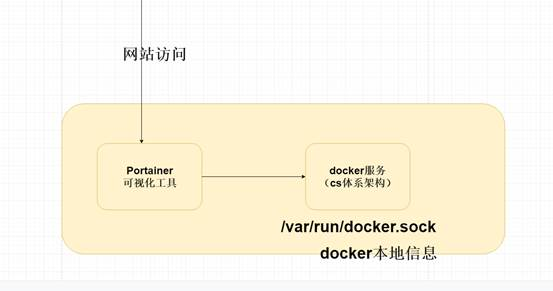

## Docker Compose

 

Sit pre prd环境

### 为什么需要使用Docker Compose

Docker Compose 容器编排技术

 

容器编排技术

 

1.现在我们有一个springboot项目，需要依赖Redis、mysql5.7、nginx。

如果使用docker原生部署的话，则需要安装Redis、mysql5、nginx容器，在才可以启动我们springboot项目，这样的话部署项目的流程非常复杂，所以需要引入我们的

Docker compose实现容器编排技术。


 

 

### 基本的概念

Docker-Compose项目是**Docker****官方的开源项目**，负责实现对Docker容器集群的快速编排。

Docker-Compose将所管理的容器分为三层，分别是工程（project），服务（service）以及容器（container）。

开发一个springboot项目---大工程

1. 依赖mysql
2. 依赖redis
3. 依赖zk

等。

需要在docker-compose.yml 配置项目工程依赖环境配置

 

Docker-Compose运行目录下的所有文件（docker-compose.yml，extends文件或环境变量文件等）组成一个工程，若无特殊指定工程名即为当前目录名。一个工程当中可包含多个服务，每个服务中定义了容器运行的镜像，参数，依赖。一个服务当中可包括多个容器实例，Docker-Compose并没有解决负载均衡的问题，因此需要借助其它工具实现服务发现及负载均衡。

 

Docker-Compose的工程配置文件默认为docker-compose.yml，可通过环境变量COMPOSE_FILE或-f参数自定义配置文件，其定义了多个有依赖关系的服务及每个服务运行的容器。

 

Compose 中有两个重要的概念：

 

服务 (service) ：一个应用的容器，实际上可以包括若干运行相同镜像的容器实例。

项目 (project) ：由一组关联的应用容器组成的一个完整业务单元，在 docker-compose.yml 文件中定义。

一个项目可以由多个服务（容器）关联而成，Compose 面向项目进行管理，通过子命令对项目中的一组容器进行便捷地生命周期管理。

 

Compose 项目由 Python 编写，实现上调用了 Docker 服务提供的 API 来对容器进行管理。因此，只要所操作的平台支持 Docker API，就可以在其上利用 Compose 来进行编排管理。

 

Docker-Compose分成三层

1.项目层 springboot项目依赖于我们的mysql redis、nginx等 一个项目是由多个容器组成的。

2.服务层 运行一个镜像的实例 ---

 

 

### Compose环境安装（离线安装）

 

1. 访问docker compose github 官网

 


**2.**   **docker-compose-Linux-x86_64** **上传到服务器中，然后执行如下命令将其移动到/usr/local/bin/****目录中** **并且更名为docker-compose**

**mv docker-compose-Linux-x86_64 /usr/local/bin/docker-compose**

**3.**   **执行如下命令：添加可执行的权限**

**sudo chmod +x /usr/local/bin/docker-compose**

**4.**   **验证docker-compose** 

**docker-compose -v**


### Compose常用命令

docker-compose -h              # 查看帮助

 

docker-compose up              # 创建并运行所有容器

docker-compose up -d            # 创建并后台运行所有容器

docker-compose -f docker-compose.yml up -d # 指定模板

docker-compose down             # 停止并删除容器、网络、卷、镜像。

 

docker-compose logs    # 查看容器输出日志

docker-compose pull    # 拉取依赖镜像

dokcer-compose config   # 检查配置

dokcer-compose config -q # 检查配置，有问题才有输出

 

docker-compose restart  # 重启服务

docker-compose start   # 启动服务

docker-compose stop   # 停止服务

 

### Compose入门案例

 

**流程：**

**1.**   **需要定义一个docker-compose.yml****文件----****工程**

**2.**   **需要在docker-compose****文件配置依赖服务**

**3.**   **docker-compose up** **执行该文件**

 

 

 

 

 

 

 

 

 

**1.**   创建一个docker-c**ompose.yml****；**

**2.**   **定制docker-compose** **内容；**

**3.**   **运行 docker-compose up** **；**

 

```
version: '3.0'
services:
  tomcat: ##服务名称
    image: tomcat:8 #镜像文件名称
    ports:
    - 8080:8080

```

 


### Compose模板文件

```
version: '3.0'
services:
  tomcat80: ##服务名称
    #container_name: tomcat8080 指定容器名称
    image: tomcat:8 #镜像文件名称 run images
    ports:  ###端口号的映射 -p
    - 8080:8080
    volumes: ## 数据源 宿主机与容器数据共享  -v
      - /usr/tomcat/webapps:/usr/local/tomcat/webapps
    networks:  ###定义网络的桥
      - mayikt

  tomcat81: ##服务名称
    #container_name: tomcat8080 指定容器名称
    image: tomcat:8 #镜像文件名称
    ports:  ###端口号的映射
      - 8081:8080
    volumes: ## 数据源 宿主机与容器数据共享
      - /usr/tomcat/webapps:/usr/local/tomcat/webapps
    networks:
      - mayikt
networks:  ## 定义服务的桥
  mayikt:

```


###   Compose常用命令

 

**docker-compose ps** **列出项目中所有的容器**

**docker-compose stop** **停止docker-compose**

**docker-compose logs** **查看容器中日志信息**

**docker-compose pull** **拉取服务依赖的镜像**

 

### Compose常用配置

 

Image 镜像名称；

Build 根据docker file 打包 成镜像；

Context 指定docker file文件位置；

Commond 使用command可以覆盖容器启动后默认执行的命令；

Container_name 容器名称；

depends_on 指定依赖那个服务；

Ports 映射的端口号；

extra_hosts 会在/etc/hosts文件中添加一些记录；

Volumes 持久化目录；

volumes_from 从另外一个容器挂在数据卷；

Dns 设置dns

 

 

### Compose部署springboot项目

#### 定义Compose文件

```
version: "3.0"
services:
  mysql: # mysql服务
    image: mysql:5.7
    command: --default-authentication-plugin=mysql_native_password #解决外部无法访问
    ports:
      - "3306:3306"      #容器端口映射到宿主机的端口
    environment:
      MYSQL_ROOT_PASSWORD: 'root'
      MYSQL_ALLOW_EMPTY_PASSWORD: 'no'
      MYSQL_DATABASE: 'mayikt'
      MYSQL_USER: 'mayikt'
      MYSQL_PASSWORD: 'mayikt'
    networks:
      - mayikt_web
  mayikt-web: #自己单独的springboot项目
    hostname: mayikt
    build: ./     #需要构建的Dockerfile文件
    ports:
      - "38000:8080"      #容器端口映射到宿主机的端口
    depends_on:      #web服务依赖mysql服务，要等mysql服务先启动
      - mysql
    networks:
      - mayikt_web
networks:  ## 定义服务的桥
  mayikt_web:

```


#### Spring项目配置

```
spring:
  profiles:
    active: prd
  datasource:
    url: jdbc:mysql://mysql:3306/mayikt?useUnicode=true&characterEncoding=UTF-8&serverTimezone=UTC
    username: root
    password: root
    driver-class-name: com.mysql.jdbc.Driver
server:
  ###端口号
  port: 8080
  servlet:
    ##设置springboot项目访问路径
    context-path: /mayikt

```


#### 演示效果

http://192.168.163.129:38000/mayikt/insertUser?userName=mayikt&userAge=22

 

### Docker可视化工具使用

#### Portainer

Portainer是一款Docker可视化管理工具，允许我们在网页中方便的查看和管理Docker容器。

要使用Portainer很简单，运行下面两条命令即可。这些命令会创建一个Portainer专用的卷，然后在8000和9000端口创建容器并运行。


 

启动：

```
  docker run -d -p 9000:9000  --name=portainer --restart=always -v  /var/run/docker.sock:/var/run/docker.sock -v portainer_data:/data  portainer/portainer  
```



## CentOS Docker 安装

docker rm $(docker ps -aq)

docker stop $(docker ps -q) & docker rm $(docker ps -aq) ---删除所有的容器

docker rmi $(docker images -q)

docker network ls

## Linux关闭防火墙命令

systemctl stop firewalld