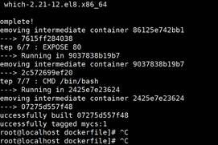

## DockerFile 解析

 

一个镜像文件到底是如何创建？

 

1. dockerfile 描述出镜像文件需要的一些依赖配置和环境变量 执行命令
2. 将我们dockerfile 文件打包成一个镜像文件
3. 直接使用我们的容器运行到该镜像文件。


1. 需要手动编写一个dockerfile文件
2. 将该dockerfile docker build 自定义成一个镜像文件
3. docker run 运行容器

 

 

### Centos镜像文件

docker run -it centos 

 

 

https://github.com/CentOS/sig-cloud-instance-images/blob/b2d195220e1c5b181427c3172829c23ab9cd27eb/docker/Dockerfile

 

### DockerFile编写规范

A.#描述注释

B.指令必须要大写，后面至少需要带至少一个参数;

C.指令是按照从上到下，顺序执行；

### DockerFile指令

 

1. FROM 指定父镜像: 基于哪个镜像image构建 指定基础镜像，必须为第一个命令
2. MAINTAINER :维护者
3. RUN: 容器创建的时候执行一段命令  构建镜像时执行的命令
4. ADD: 将本地文件添加到容器中，tar类型文件会自动解压(网络压缩资源不会被解压)，可以访问网络资源，类似wget
5. COPY:功能类似ADD，但是是不会自动解压文件，也不能访问网络资源
6. CMD:构建容器后调用，也就是在容器启动时才进行调用。 .sh执行文件
7. ENV: 设置环境变量
8. EXPOSE: 指定于外界交互的端口
9. VOLUME 用于指定持久化目录
10. WORKDIR 设置进入容器时的路径 默认访问的目录

Tomcat-----jdk环境

 

 

Tomcat docker File：

https://github.com/docker-library/tomcat/blob/385e8403a38fab7097d4c3fed2484caba7dfd099/8.5/jdk8/openjdk-slim-buster/Dockerfile

 

https://github.com/docker-library/redis/blob/231905d0841f52ee4f3a5b8b42d62cd6d14a1a93/6.2/Dock

 

进入tomcat 容器----/data

redis容器/data

/ 

### DockerFile案例

Base镜像(scratch) docker hub中的镜像都是通过base镜像中安装和配置需要的软件构建的。

#### 构建自己centos镜像

docker run -it centos

 

1. 需求定制修改centos根目录； 
2. 实现支持vim插件；

 

 

yum -y install vim 

 

1. 需要自己制作一个dockerfile文件
2. 继承docker hub中的centos
3. 在docker hubcentos 上加入以下两个功能

A.进入容器中 默认访问目录/usr

B.实现支持vim插件

 

需要将该dockerfile文件打包成一个镜像文件 交给我们容器执行

 

 

 

 

https://github.com/CentOS/sig-cloud-instance-images/blob/b2d195220e1c5b181427c3172829c23ab9cd27eb/docker/Dockerfile

 

 

定制CentOS镜像

```
FROM  centos
MAINTAINER mayikt-yushengjun
ENV  MYPATH /usr
WORKDIR $MYPATH
RUN yum -y install vim
EXPOSE 80
CMD /bin/bash
```


 

Dockerfile→使用docker 将该Dockerfile实现打包成镜像文件→

容器运行该镜像文件。

 

docker build---将该Dockerfile实现打包成镜像文件

 

将该dockerfile文件上传到linux服务器中

使用docker build -f Dockerfile -t mycs:1 .

Dockerfile ------配置文件

mycs----打包镜像文件名称

1 tag 版本号码



 

 

docker run -it mycs:1 

#### 将springboot项目打包部署

1. 基于docker原生方式 部署我们的springboot项目

Dockerfile

2.dockercompose----- 容器编排技术

 

springboot项目----变成镜像文件---容器运行

1. 将我们springboot项目---打成一个jar包

 

2.定义dockerfile文件-----描述出springboot项目 配置依赖和环境变量

JDK

注意：springboot内置嵌入我们的tomcat服务器 所以不需要额外的tomcat容器来

运行。

原生方式运行我们的jar包 

Java- jar指令 

2. 需要先将我们外部jar，拷贝到容器中
3. 容器运行成功执行java -jar

2.将该dockerfile文件打包成镜像文件-

 


1. 将springboot项目打包；
2. 制作dockerfile文件；

A. 继承我们的jdk环境

B. 将我们本地的jar包拷贝到容器中

C. Java -jar

 

3. 将dockerfile文件打包成镜像文件；
4. 运行该镜像文件即可；

 

##### 将springboot项目打包

mvn clean package 

##### 制作dockerfile文件

```
# 基础镜像使用java
FROM java:8
# 作者
MAINTAINER www.mayikt.com
# VOLUME 指定了临时文件目录为/tmp。
# 其效果是在主机 /var/lib/docker 目录下创建了一个临时文件，并链接到容器的/tmp
VOLUME /tmp
# 将jar包添加到容器中并更名为mayikt.jar
ADD mayikt-thymeleaf-1.0-SNAPSHOT.jar mayikt.jar
# 运行jar包
RUN bash -c 'touch /mayikt.jar'
ENTRYPOINT ["java","-Djava.security.egd=file:/dev/./urandom","-jar","/mayikt.jar"]
#暴露8080端口
EXPOSE 8080
```


##### 打包成镜像文件

docker build -f Dockerfile -t mayikt-member:1 .

docker build -f Dockerfile -t mayikt-member:1 .

##### 启动容器

docker run -p 8070:8080  mayikt-member:1

 

##### 访问测试

