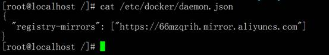

### 阿里云加速镜像配置

科大镜像：https://docker.mirrors.ustc.edu.cn/

网易：https://hub-mirror.c.163.com/

阿里云：https://<你的ID>.mirror.aliyuncs.com

 

阿里云镜像获取地址：https://cr.console.aliyun.com/cn-hangzhou/instances/mirrors，登陆后，左侧菜单选中镜像加速器就可以看到你的专属地址了：


 

 

 

```
sudo mkdir -p /etc/docker

sudo tee /etc/docker/daemon.json <<-'EOF'

{

 "registry-mirrors": ["https://66mzqrih.mirror.aliyuncs.com"]

}

EOF

sudo systemctl daemon-reload

sudo systemctl restart docker
```

 



### 如何查看加速镜像安装成功

输入：docker info

