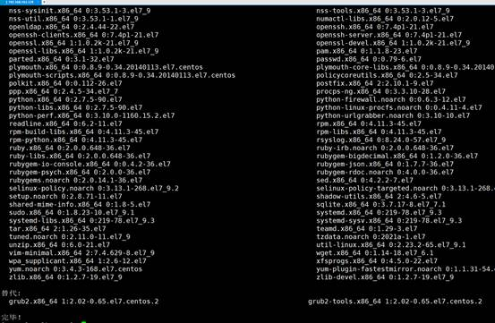

# CentOS

Docker 要求 CentOS7 系统的内核版本在 3.10以上 ，查看本页面的前提条件来验证你的CentOS 版本是否支持 Docker 。

1、通过 uname -r 命令查看当前的内核版本

  uname -r  

2、  使用 root 权限登录 Centos。确保 yum 包更新到最新。

| yum -y update                                                |
| ------------------------------------------------------------ |
|   该过程大概需要维持10分钟左右 |

3、  卸载旧版本(如果安装过旧版本的话)

  yum remove docker docker-common  docker-selinux docker-engine

    

4、  安装需要的软件包， yum-util 提供yum-config-manager功能，另外两个是devicemapper驱动依赖的

  yum install -y yum-utils  device-mapper-persistent-data lvm2

    

5、  设置yum源

  yum-config-manager --add-repo  https://download.docker.com/linux/centos/docker-ce.repo  

6、  可以查看所有仓库中所有docker版本，并选择特定版本安装

  yum list docker-ce --showduplicates | sort -r  

7、  安装docker

  sudo yum install -y docker-ce   #由于repo中默认只开启stable仓库，故这里安装的是最新稳定版18.03.1  

8、  启动并加入开机启动

  systemctl start docker  systemctl enable docker  

9、  验证安装是否成功(有client和service两部分表示docker安装启动都成功了)

  docker version  

# Ubuntu:

**1、更新 Ubuntu**

打开终端，依次运行下列命令：

```text
$ sudo apt update
$ sudo apt upgrade
$ sudo apt full-upgrade
```

**2、添加 Docker 库**

首先，安装必要的证书并允许 apt 包管理器使用以下命令通过 HTTPS 使用存储库：

```text
$ sudo apt install apt-transport-https ca-certificates curl software-properties-common gnupg lsb-release
```

然后，运行下列命令添加 Docker 的官方 GPG 密钥：

```text
$ curl -fsSL https://download.docker.com/linux/ubuntu/gpg | sudo gpg --dearmor -o /usr/share/keyrings/docker-archive-keyring.gpg
```

添加 Docker 官方库：

```text
$ echo "deb [arch=$(dpkg --print-architecture) signed-by=/usr/share/keyrings/docker-archive-keyring.gpg] https://download.docker.com/linux/ubuntu $(lsb_release -cs) stable" | sudo tee /etc/apt/sources.list.d/docker.list > /dev/null
```

使用命令更新 Ubuntu 源列表：

```text
$ sudo apt update
```

**3、安装 Docker**

最后，运行下列命令在 Ubuntu 22.04 LTS 服务器中安装最新 Docker CE：

```text
$ sudo apt install docker-ce docker-ce-cli containerd.io docker-compose-plugin
```

当然你也可以安装其他版本 Docker 。运行下列命令检查可以安装的 Docker 版本：

```text
$ apt-cache madison docker-ce
```

输出样例：

```text
docker-ce | 5:20.10.17~3-0~ubuntu-jammy | https://download.docker.com/linux/ubuntu jammy/stable amd64 Packages
docker-ce | 5:20.10.16~3-0~ubuntu-jammy | https://download.docker.com/linux/ubuntu jammy/stable amd64 Packages
docker-ce | 5:20.10.15~3-0~ubuntu-jammy | https://download.docker.com/linux/ubuntu jammy/stable amd64 Packages
docker-ce | 5:20.10.14~3-0~ubuntu-jammy | https://download.docker.com/linux/ubuntu jammy/stable amd64 Packages
docker-ce | 5:20.10.13~3-0~ubuntu-jammy | https://download.docker.com/linux/ubuntu jammy/stable amd64 Packages
```

你可以挑选上面列表中的任何版本进行安装。例如，安装 **5:20.10.16~ 3-0 ~ubuntu-jammy** 这个版本，运行：

```text
$ sudo apt install docker-ce=5:20.10.16~3-0~ubuntu-jammy docker-ce-cli=5:20.10.16~3-0~ubuntu-jammy containerd.io
```

安装完成后，运行如下命令验证 Docker 服务是否在运行：

```text
$ systemctl status docker
```


当然你也可以安装其他版本 Docker 。运行下列命令检查可以安装的 Docker 版本：

```text
$ apt-cache madison docker-ce
```

输出样例：

```text
docker-ce | 5:20.10.17~3-0~ubuntu-jammy | https://download.docker.com/linux/ubuntu jammy/stable amd64 Packages
docker-ce | 5:20.10.16~3-0~ubuntu-jammy | https://download.docker.com/linux/ubuntu jammy/stable amd64 Packages
docker-ce | 5:20.10.15~3-0~ubuntu-jammy | https://download.docker.com/linux/ubuntu jammy/stable amd64 Packages
docker-ce | 5:20.10.14~3-0~ubuntu-jammy | https://download.docker.com/linux/ubuntu jammy/stable amd64 Packages
docker-ce | 5:20.10.13~3-0~ubuntu-jammy | https://download.docker.com/linux/ubuntu jammy/stable amd64 Packages
```

你可以挑选上面列表中的任何版本进行安装。例如，安装 **5:20.10.16~ 3-0 ~ubuntu-jammy** 这个版本，运行：

```text
$ sudo apt install docker-ce=5:20.10.16~3-0~ubuntu-jammy docker-ce-cli=5:20.10.16~3-0~ubuntu-jammy containerd.io
```

安装完成后，运行如下命令验证 Docker 服务是否在运行：

```text
$ systemctl status docker
```