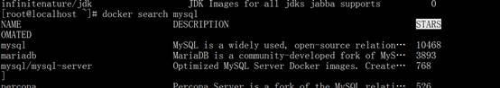
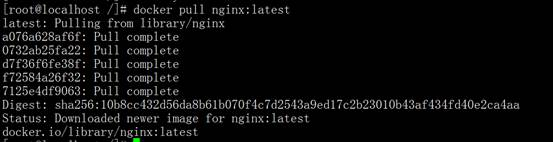
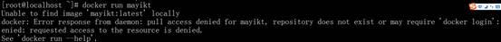
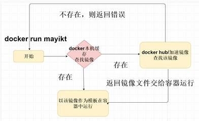
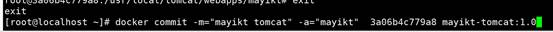
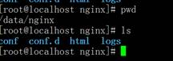
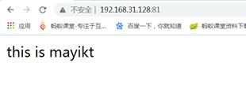
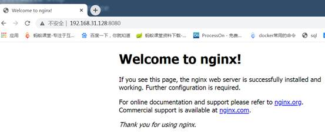
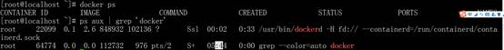

## Docker常用命令

docker --help 帮助命令

### docker --version

docker -version

### docker images

查看本地images 镜像缓存

 

docker images 查看本地镜像文件

docker rmi -f kibana:5.6.9 ---删除镜像文件

 

REPOSITORY 存储库名称

Tag 镜像的标签 不写版本号码 默认下载最新latest镜像

IMAGE ID  镜像id

CREATED 创建时间

SIZE 大小

 

docker images -a

docker images -q ---只显示镜像的id

docker images --digests ---显示镜像的摘要信息

docker images --no-trunc ---显示完整镜像信息

 

docker rmi tomcat（镜像文件名称） 

### docker search 

docker search mysql 

https://hub.docker.com/

docker search -s 30 mysql 列出点赞数超过30以上。

 

[latest](https://github.com/docker-library/mysql/blob/d72fdef749b3b6c140e4b0d6a87f12737ed3554a/8.0/Dockerfile.debian) 表示为最新的镜像文件 mysql8.0版本

### docker pull   

latest -----tag 最新版本的镜像文件

docker pull nginx:latest --默认的情况下 下载最新版本的镜像 可以通过

如果我们想下载老版本则把latest 换成对应的版本号

https://hub.docker.com/_/nginx?tab=tags&page=1&ordering=last_updated

### 容器管理

#### 查看容器信息

Docker ps 获取到容器id

docker inspect 1e07cc5cc78d

`docker inspect` 命令用于获取 Docker 对象（容器、镜像、卷、网络等）的详细信息。

`docker inspect` 命令返回 JSON 格式的详细信息，可以帮助用户了解对象的配置和状态。

#### 运行容器

##### docker run

docker run -i（保持容器一直运行）-t（给容器一个伪终端）-d(后台运行，不直接进入容器) --name=tomcat9.2（给启动容器起名字）-p 8080:8080(宿主:docker容器)tomcat:9.2(启动的容器) 【参数】(加入容器初始化命令)

\#通过 -it 启动的容器有两个特点 一创建就进入容器 exit退出容器 容器就会停止运行 ---交互式容器

\#通过 -id 创建的容器 docker exec -it tomcat9.2（--name起的名称）进入容器 exit退出容器 容器不会停止运行  ---守护式容器

docker ps 查看正在运行的容器

docker ps -a 查看运行和已经运行关闭大的容器

docker stop tomcat8 关闭容器

docker start tomcat8 启动容器

docker rm tomcat8 删除容器

docker inspect tomcat8 查看容器信息

docker exec 参数 进入容器

docker run 运行原理

 

docker run mayikt 

 

 

xxxxxxxxxx $ systemctl status dockertext

阿里云仓库查找该镜像文件，如果阿里云仓库也没有该镜像文件，则会报错找不到

镜像文件。

获取到镜像文件之后直接运行。

详细描述： 

1.docker在本机缓存中 mayikt镜像文件，如果本地存在该镜像文件

，则以该镜像文件作为模板在容器中运行。

2.如果本地缓存中，没有mayikt镜像文件 则会从dockerhub 或者加速镜像中

查找，如果查找不到的话，则返回错误找不到该镜像。

1. 如果能够查找到该镜像，则以该镜像作为模板运行。

 

每个容器都有自己独立的网络 ip信息 运行成功 就是一个轻量级linux操作系统

 

 

 

启动容器

docker start 容器id

停止容器

docker stop 容器id

删除容器

docker rm 容器id

进入容器中

 

\# 首先使用下面的命令，查看容器ID（CONTAINER ID）：

docker ps -a

\# 然后用下面的命令进入容器，就可以使用bash命令浏览容器里的文件：

docker exec -it [CONTAINER ID] bash

\# 有的镜像没有bash命令，可以用对应的shell，比如sh

docker exec -it [CONTAINER ID] sh

### Docker Commit

主要作用：根据当前容器制作为镜像文件

 

流程：

1. 从docker hub中下载一个tomcat8镜像文件；
2. 运行tomcat8镜像文件 在tomcatwebapps 目录中新增 mayikt文件夹 index.html
3. 将当前容器内容根据模板制作为镜像文件

 

docker commit提交容器副本使之成为一个新的镜像

命令：docker commit -m=“提交的描述信息” -a=“作者” 容器ID 要创建的目标镜像名:[标签名]

 

 

1. 安装一个tomcat8

docker run -p 8081:8080  tomcat:8

2. docker exec -it 3a06b4c779a8  bash
3. cd webapps 
4. mkdir mayikt 
5. touch index.html
6. echo "mayikt" >>index.html

 

 

docker commit -m=“提交的描述信息” -a=“作者” 容器ID 要创建的目标镜像名:[标签名]

 

1.根据当前容器作为模板制作为镜像文件

docker commit -m="mayikt tomcat" -a="mayikt" 3a06b4c779a8 mayikt-tomcat:1.0

2.在以当前自己制作的镜像文件运行

docker run -p 8088:8080  mayikt-tomcat:1.0

### Docker数据卷

 

#### 基本的概念

数据卷就是宿主机上的一个文件或目录

当容器目录和数据卷（宿主机）目录绑定，双方修改会立即同步操作

一个数据卷可以被多个容器同时挂载

数据卷作用：容器数据的持久化 外部机器和容器间接通信 容器之间数据交换

使用 -v命令。

#### 数据卷添加的方式

容器内与宿主机实现数据的共享

数据卷--添加两种方式

1. 直接命令形式添加 docker run -it -v 宿主机绝对路径目录:容器内目录 镜像文件名称
2. Dockerfile方式添加

 

##### 安装Nginx实现负载均衡

###### 挂载nginx html文件

https://hub.docker.com/search?q=nginx&type=image

1. 创建挂载目录

mkdir -p /data/nginx/{conf,conf.d,html,logs}

2. 启动docker容器

docker run --name nginx81 -d -p 81:80 -v /data/nginx/html:/usr/share/nginx/html nginx

 

-v /data/nginx/html 虚拟机目录 --挂载 容器目录 /usr/share/nginx/html

上传一个 html 放入到 /data/nginx/html

 

docker run --name nginx81 -d -p 81:80 -v /data/nginx/html:/usr/share/nginx/html nginx

 

-v /data/nginx/html: linux虚拟机目录

/usr/share/nginx/html 容器中html目录

###### nginx .conf文件和日志文件

docker run --name nginx81 -d -p 81:80 -v /data/nginx/html:/usr/share/nginx/html \

-v /data/nginx/conf/nginx.conf:/etc/nginx/nginx.conf \

-v /data/nginx/logs:/var/log/nginx nginx 

 

\反斜杠 表示换行

/usr/share/nginx/html

/usr/share/nginx/conf

/usr/share/nginx/log

 

#### Docker实战部署软件

##### 安装Tomcat服务器

docker run -p 8081:8080  tomcat:8

 

 

-p 8081 :8080  容器外部（linux虚拟机访问端口8081）:8080（容器端口号）

docker ps 获取tomcat正在运行的容器id 进入到中 

docker exec -it 1210e05f1a59 bash

 

docker run -p 8081:8080  tomcat:8

 

-p 8081:8080 8081(linux虚拟机访问的端口号):8080(容器内部中端口号)

 

docker run -p 8081:8080 -d  tomcat:8 后台启动 ---每次运行都会创建一个新的容器

 

docker run --name mayikt-tomcat -p 8081:8080 -d  tomcat:8 

 

--name: 指定容器名称

-p:指定容器端口号

-d:指定容器后台运行

docker run --name mayikt-tomcat  tomcat

 

docker run --name mayikt-tomcat1 -p 8081:8080 tomcat

8081（容器外部或者linux虚拟机访问的端口号 宿主机）

8080 容器内部的端口号

docker run --name mayikt-tomcat2022 -p 8081:8080 -d  tomcat:8 

-d 后台启动

前台启动与后台启动的区别

前台启动会打印启动日志信息

后台启动不会打印启动日志信息

 

 

 

##### 安装Nginx实现静态服务

Docker run 运行容器

 

--name nginx-test：容器名称。

-p 8080:80  端口进行映射，将本地 8080 端口映射到容器内部的 80 端口。

-d nginx： 设置容器在在后台一直运行。

 

docker ps --- 正在运行的容器

docker ps -a 显示所有的容器 包括为运行的容器

docker ps 容器id

 

docker run --name nginx-mayikt -p 8080:80 nginx  默认前台启动

docker run --name nginx-mayikt -p 8080:80 -d nginx  后台启动方式

 

前台与后台启动区别：

 

前台启动：会展示容器启动的日志信息-----

后台启动：不会展示启动日志信息 

 

8080:80 8080 虚拟机本地端口 ---浏览器访问 80 容器内部端口

 Elk+kafka---

 systemctl stop firewalld 

##### 安装MySQL5.7

1.查询mysql版本

  docker search mysql  

2.下载MySQL5.7版本

  docker pull mysql:5.7 (这里选择的是第一个mysql镜像， :5.7选择的5.7版本)  

3.等待下载完成、创建MySQL容器

  docker create --name mysql3308 -e  MYSQL_ROOT_PASSWORD=root -p 3308:3306 mysql:5.7  

 创建容器名称为mysql3308，密码为root

1. 启动容器

docker start mysql3308

2. 进入到容器

docker exec -it mysql3308 bash

3. mysql连接

mysql -uroot –p

#### Docker运行底层原理

1. 首先启动docker systemctl start docker
2. Docker是一个CS架构的系统，docker守护进程运行在主机上，然后通过socket连接

从客户端访问，守护进程从客户端接收命令管理运行在主机上的容器。

ps aux | grep 'docker'

 

网站“bs”CS

#### 数据卷volumes-from

容器间传递共享数据volumes-from

 

### 启动容器报错了如何解决？

先改为前台启动如果没有问题的情况下，在修改为后台启动。

## 容器与容器局域网