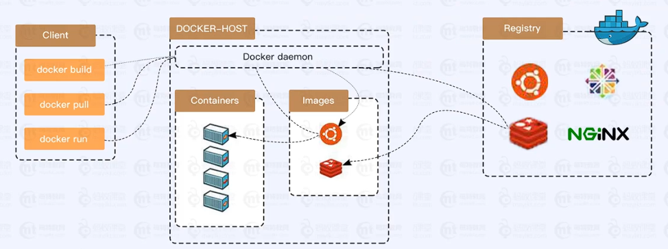
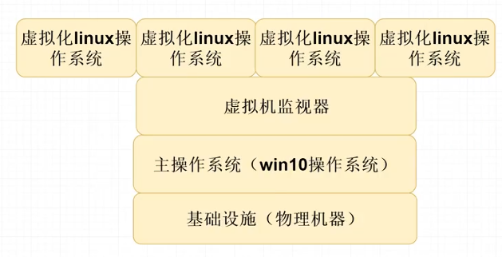
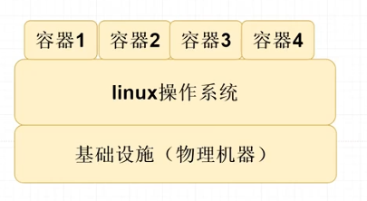
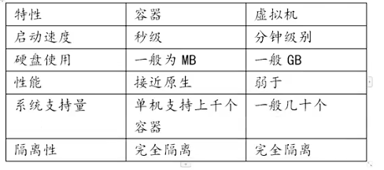

# Docker的核心名词

三大核心要素:

1. 仓库---专门存放我们的镜像文件，类似于软件市场

2. 镜像 --- 类似于安装包 描述运行所需要的环境配置和依赖

   Redis镜像、tomcat镜像

   方式来源

   A. springboot项目（自己创建的镜像文件)

   B. DOCKER hub 仓库中下载

   [Docker Hub Container Image Library | App Containerization](https://hub.docker.com/)

3. 容器---运行我们的镜像文件 自己独立的IP和网络信息 虚拟化出一个轻量级的Linux系统精简版本

Docker架构图:

在使用docker pull 时候先去 Images里面去找有无需要的镜像文件，没有则会去仓库中下载缓存到本地。

容器和虚拟机的区别

虚拟机：

Docker：

区别：

1. 从架构上看，虚拟机是硬件级别进行的虚拟化，模拟硬件搭建操作系统，而Docker是在操作系统层面虚拟化，复用操作系统，运行Docker容器。

2. Docker的速度很快，秒级，而虚拟机是分级。
3. Docker使用的资源更少，性能更高，同样一个物理机器，Docker运行的镜像数量远多于虚拟机数量。
4. 虚拟机实现了操作系统之间的个独立，Docker是进程之间的隔离，虚拟机隔离级别更高，安全性更强。
5. 虚拟机和Docker各有优势，不存在谁代替谁，很多企业采用虚拟机运行Docker的方式。